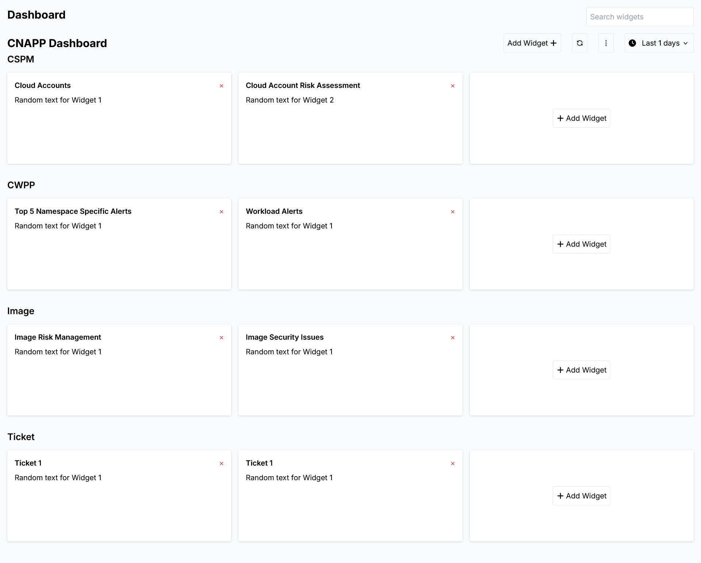

# Dashboard widgets app

## System Requirements

    # Node.js 16.8 or later.
    # MacOS, Windows (including WSL), and Linux are supported.

## Prerequisites

    # Download the Node js and setup your environment

    # Check your node version
    $ node -v

    # Check package manager version
    $ yarn -v (or) npm -v

## Quick Start

    # Clone the application
    $ git clone https://github.com/mounikagonti/dashboard-widgets.git

    # Install dependencies
    $ yarn install (or) npm install

    # Serve on localhost:3000
    $ yarn run dev (or) npm run dev
